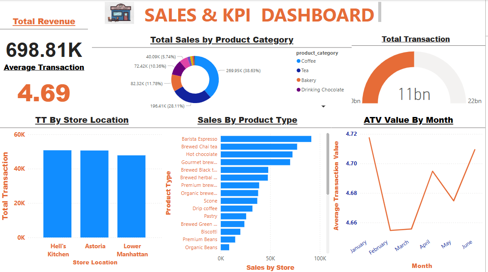

# 📊 Maven Roasters Sales Analysis – Power BI Project

## 🏪 Project Overview
**Maven Roasters** is a fictional coffee shop with three locations in New York City. This project uses transactional sales data to analyze business performance, track sales trends, evaluate top products, and compare performance across store locations using **Power BI**.

---

## 📁 Dataset Description

The dataset includes detailed sales transactions and comprises the following key columns:

| Column Name        | Description                                      |
|--------------------|--------------------------------------------------|
| Transaction Date   | Date of the sale                                 |
| Timestamp          | Exact time the transaction occurred              |
| Store Location     | Name or code of the NYC location                 |
| Product Name       | Name of the product sold                         |
| Category           | Product category (e.g., Beverages, Pastries)     |
| Quantity           | Number of units sold                             |
| Unit Price         | Price per unit                                   |
| Revenue            | Total sale amount (Quantity × Unit Price)        |

---

## 🎯 Project Objectives

This Power BI report helps Maven Roasters:

- 🔄 **Analyze sales trends over time** (daily, monthly, yearly)
- 🥇 **Identify top-performing products and categories**
- 📍 **Compare sales performance across different store locations**

---

## 📊 Power BI Report Features and DashBoard

### 1. **Sales Trend Analysis**
- Line and area charts showing daily and monthly revenue

### 2. **Product & Category Performance**
- Bar charts for top products by quantity and revenue
- Donut charts for product category-level insights

### 3. **Location Comparison**
- Store-wise revenue comparison using bar charts

### 4. **KPIs & Summary Cards**
- Total Revenue
- Total Transactions
- Average Transaction Value

## 🔗 Live Power BI Dashboard
👉 [Click here to view the interactive Power BI Dashboard](https://app.powerbi.com/view?r=eyJrIjoiNjdhZDZiZTMtYzNiZC00ZTAyLWJjOGEtZTIyNDUzMGRmM2NlIiwidCI6IjZlZmQwZjIwLTU3YzgtNDQ0Ny1iNTNmLTAwZDQ5OTJjYTUwYiJ9)



---
 ## 🔧 Data Preparation Steps
- Load dataset into Power BI
- Format date and time fields
- Create a Calendar Table and establish relationships
- Clean product and category data if needed
- Create calculated columns and DAX measures
---
## ✨ Recommendations
Shops can Focus on expanding their coffee and tea offerings, as these categories generate the most revenue:

- Coffee leads with $269,952.45
- Tea follows with $196,405.95

### You could offer below to improvise sales:

- Introducing premium or seasonal coffee blends.
- Offering tea tastings.
- Bundling coffee/tea with bakery items to increase average transaction value

## Challenges Encountered During Power BI Report Development
1. Data Formatting Issues
Raw data is stored in a single column with pipe (|) separators.
Requires preprocessing to split fields before using in Power BI.

2. Data Cleaning & Transformation
Conversion of data types (dates, numbers).
Removal of duplicates or handling of missing values.
Need for calculated columns (e.g., Revenue = Qty × Unit Price).

## 🧮 DAX Measures Used

These are the key DAX measures used in the Power BI dashboard:

```DAX
-- Basic Measures
Total Revenue = SUM('Sales'[Revenue])
Total Transactions = COUNT('Sales'[Transaction ID])
Average Transaction Value = [Total Revenue] / [Total Transactions]
Sales Volume = SUM('Sales'[Quantity])
--- 
🕒 Optional Time Intelligence Measures
-- Month-to-Date Revenue
MTD Revenue = TOTALMTD([Total Revenue], 'Sales'[Transaction Date])
-- Year-to-Date Revenue
YTD Revenue = TOTALYTD([Total Revenue], 'Sales'[Transaction Date])

