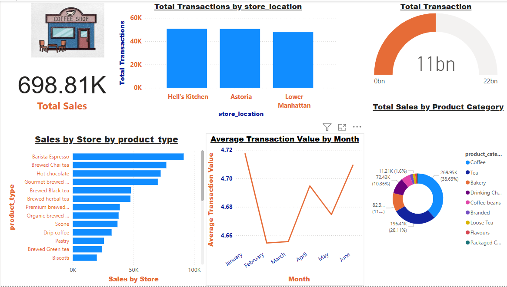

# 📊 Maven Roasters Sales Analysis – Power BI Project

## 🏪 Project Overview
**Maven Roasters** is a fictional coffee shop with three locations in New York City. This project uses transactional sales data to analyze business performance, track sales trends, evaluate top products, and compare performance across store locations using **Power BI**.

---

## 📁 Dataset Description

The dataset includes detailed sales transactions and comprises the following key columns:

| Column Name        | Description                                      |
|--------------------|--------------------------------------------------|
| Transaction Date   | Date of the sale                                 |
| Timestamp          | Exact time the transaction occurred              |
| Store Location     | Name or code of the NYC location                 |
| Product Name       | Name of the product sold                         |
| Category           | Product category (e.g., Beverages, Pastries)     |
| Quantity           | Number of units sold                             |
| Unit Price         | Price per unit                                   |
| Revenue            | Total sale amount (Quantity × Unit Price)        |

---

## 🎯 Project Objectives

This Power BI report helps Maven Roasters:

- 🔄 **Analyze sales trends over time** (daily, monthly, yearly)
- 🥇 **Identify top-performing products and categories**
- 📍 **Compare sales performance across different store locations**

---

## 📊 Power BI Report Features and DashBoard

### 1. **Sales Trend Analysis**
- Line and area charts showing daily and monthly revenue
- Time slicers for custom date filtering

### 2. **Product & Category Performance**
- Bar charts for top products by quantity and revenue
- Pie and donut charts for category-level insights

### 3. **Location Comparison**
- Store-wise revenue comparison using bar charts
- Optional map visualization for geographical insight

### 4. **KPIs & Summary Cards**
- Total Revenue
- Total Transactions
- Average Transaction Value
- Total Units Sold

## 🔗 Live Power BI Dashboard
👉 [Click here to view the interactive Power BI Dashboard]([https://app.powerbi.com/view?r=eyJrIjoi..](https://app.powerbi.com/view?r=eyJrIjoiNjdhZDZiZTMtYzNiZC00ZTAyLWJjOGEtZTIyNDUzMGRmM2NlIiwidCI6IjZlZmQwZjIwLTU3YzgtNDQ0Ny1iNTNmLTAwZDQ5OTJjYTUwYiJ9)



---

## 🧮 DAX Measures Used

```DAX
Total Revenue = SUM('Sales'[Revenue])
Total Transactions = COUNT('Sales'[Transaction ID])
Average Transaction Value = [Total Revenue] / [Total Transactions]
Sales Volume = SUM('Sales'[Quantity])
Optional Time Intelligence:

MTD Revenue = TOTALMTD([Total Revenue], 'Sales'[Transaction Date])
YTD Revenue = TOTALYTD([Total Revenue], 'Sales'[Transaction Date])
---
## 🔧 Data Preparation Steps
- Load dataset into Power BI
- Format date and time fields
- Create a Calendar Table and establish relationships
- Clean product and category data if needed
- Create calculated columns and DAX measures

📌 Usage Instructions
Open the .pbix file in Power BI Desktop

Use the slicers on the report to filter by date, location, or category

Hover over visuals for detailed insights and tooltips

Explore different pages for sales, product, and location analysis

📈 Insights You Can Discover
- What products or categories drive the most revenue?
- Which store location performs best overall?
- What is the average spend per transaction? 
